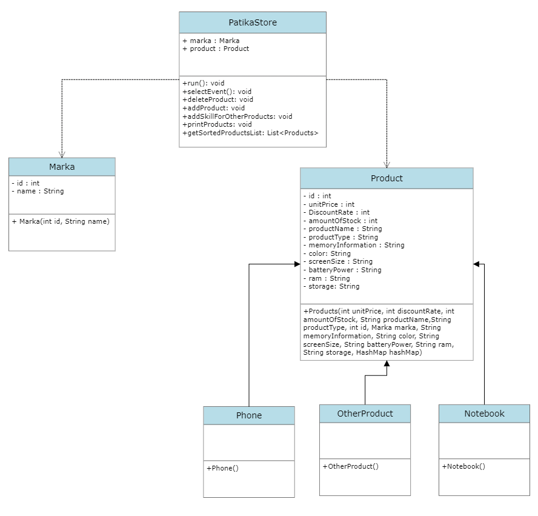

# PatikaStore Project

## Introduction
Patika store project performs the operations of saving, deleting and sorting the products in the store according to the given categories.

## How does it work?
1. insertion process
   The user chooses whether it is a phone, notebook or other products in the adding process.
   id: The id number is sorted and uniquely assigned.
   brand name: The brand name must be within the brand names in the store. otherwise no addition will be made.
   product name : the specific name of the product.
   unit price: the price of the product coming to the store
   discount rate: the discount to which it will be applied as a percentage.

2. Remove Process
   products are deleted by their id.

3. product listing.
   products are listed in a table according to their id and brand.

## UML class diagram

## Include Tests
The test process on the project was done as follows.

### Main Menu

### Insert Menu

### Inserted Product

### Product List

